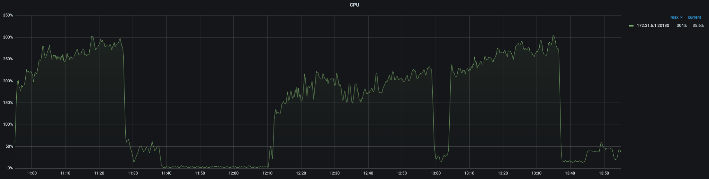
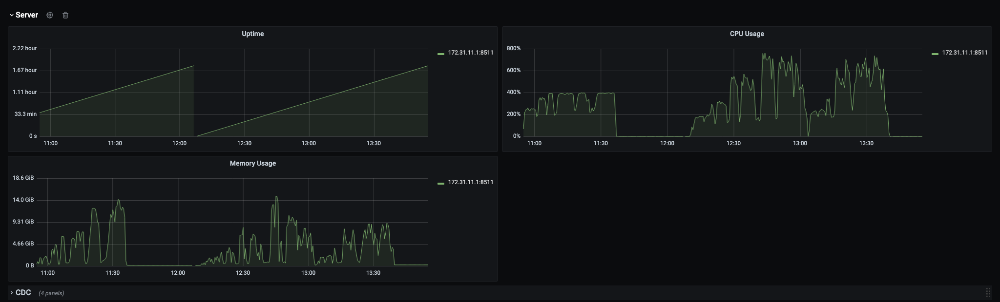

# TiCI vs Elasticsearch Write Comparison - 2026-05-07

This is the cross-system write-path comparison table for the current 10GB
Ethereum transactions smoke runs. It is intended for cost and sizing decisions,
not as a final 1TB result.

## Pricing Basis

Region: `us-west-2`

Prices were checked on 2026-05-07 with the AWS Price List API for EC2 and the
AWS EBS pricing pages for gp3/gp2:

- EC2 On-Demand Linux, shared tenancy, no preinstalled software:
  https://aws.amazon.com/ec2/pricing/
- gp3 baseline and extra-performance pricing:
  https://aws.amazon.com/ebs/general-purpose/
- EBS billing model:
  https://aws.amazon.com/ebs/pricing/

```text
c5.xlarge: $0.170/hour
r5.xlarge: $0.252/hour
m5.2xlarge: $0.384/hour
gp3 storage: $0.080/GB-month
gp3 baseline included: 3000 IOPS, 125 MiB/s
gp3 extra IOPS: $0.005/provisioned IOPS-month over 3000
gp3 extra throughput: $0.040/provisioned MiB/s-month over 125
gp2 storage: $0.100/GB-month
```

Cost model used below:

```text
1 month = 720 hours
cluster_hourly = EC2 hourly + provisioned EBS hourly
not included: S3, network transfer, snapshots, NAT, support, discounts,
              Savings Plans, Spot, or engineering time
```

## Cluster Cost

| System | Nodes | EC2 hourly | EBS hourly | Modeled hourly | Provisioned storage |
| --- | --- | ---: | ---: | ---: | ---: |
| TiCI/TiDB | 5 x `c5.xlarge`, 3 x `r5.xlarge` | $1.606 | $0.127 | $1.733 | 708GB EBS |
| TiCI/TiDB m5-worker rerun | 5 x `c5.xlarge`, 2 x `r5.xlarge`, 1 x `m5.2xlarge` | $1.738 | $0.149 | $1.887 | 908GB EBS |
| ES prod10g | 4 x `c5.xlarge` | $0.680 | $0.044 | $0.724 | 400GB EBS |
| ES prod10g EBS6000 | 4 x `c5.xlarge` | $0.680 | $0.156 | $0.836 | 400GB EBS |
| ES prod10g 6-node | 7 x `c5.xlarge` | $1.190 | $0.078 | $1.268 | 700GB EBS |

TiCI/TiDB baseline EBS detail:

| Component | Instance | Volume | IOPS | Throughput |
| --- | --- | ---: | ---: | ---: |
| center | `c5.xlarge` | 100GB gp3 | 3000 | 125 MiB/s |
| pd | `c5.xlarge` | 100GB gp3 | 3000 | 125 MiB/s |
| tidb | `c5.xlarge` | 100GB gp3 | 3000 | 125 MiB/s |
| tikv | `r5.xlarge` | 100GB gp3 | 4000 | 288 MiB/s |
| tiflash | `r5.xlarge` | 100GB gp3 | 4000 | 288 MiB/s |
| tici-worker | `r5.xlarge` | 100GB gp3 | 3000 | 125 MiB/s |
| ticdc | `c5.xlarge` | 100GB gp3 | 4000 | 288 MiB/s |
| tici-meta | `c5.xlarge` | 8GB gp2 | 100 | n/a |

TiCI/TiDB m5-worker rerun changed only these provisioned resources:

| Component | Instance | Volume | IOPS | Throughput |
| --- | --- | ---: | ---: | ---: |
| tikv | `r5.xlarge` | 300GB gp3 | 4000 | 288 MiB/s |
| tici-worker | `m5.2xlarge` | 100GB gp3 | 3000 | 125 MiB/s |

TiFlash remained stopped operationally for the write-only TiCI reruns. The TiCI
cost rows above still use the provisioned topology model so the configuration
and storage footprint are explicit.

ES prod10g EBS detail:

| Component | Instance | Volume | IOPS | Throughput |
| --- | --- | ---: | ---: | ---: |
| es-1 | `c5.xlarge` | 100GB gp3 | 3000 | 125 MiB/s |
| es-2 | `c5.xlarge` | 100GB gp3 | 3000 | 125 MiB/s |
| es-3 | `c5.xlarge` | 100GB gp3 | 3000 | 125 MiB/s |
| driver | `c5.xlarge` | 100GB gp3 | 3000 | 125 MiB/s |

ES optimization reruns:

| Run family | ES data nodes | Driver | Volume | IOPS | Throughput | Notes |
| --- | ---: | ---: | ---: | ---: | ---: | --- |
| ES prod10g EBS6000 | 3 x `c5.xlarge` | 1 x `c5.xlarge` | 100GB gp3 each | 6000 | 250 MiB/s | Same 3 primary shards, 1 replica |
| ES prod10g 6-node | 6 x `c5.xlarge` | 1 x `c5.xlarge` | 100GB gp3 each | 3000 | 125 MiB/s | 6 primary shards, 1 replica |

## Dataset Caveat

The TiCI and ES runs were both about 10GB, but they used slightly different
date slices:

| System | Manifest entries | Local parquet bytes | Rows | Logical bytes |
| --- | ---: | ---: | ---: | ---: |
| TiCI/TiDB smoke | 17 | 10,086,645,566 | 27,045,923 | 39,367,669,486 |
| ES prod10g, EBS6000, 6-node | 18 | 10,013,628,561 | 27,489,769 | 39,399,039,010 |

Use the rows/s and cost ratios as directionally useful 10GB sizing data. For a
strict final comparison, rerun both systems on the same manifest.

## Write Throughput And Cost Efficiency

`rows/s per $/hour` is the observed write throughput divided by the modeled
cluster hourly cost. Higher is better. `$ per 1M rows` is the runtime cluster
cost for that run divided by rows written. Lower is better.

| System | Run | Writer workers | Batch rows | Rows | Write elapsed | Rows/s | MB/s | Modeled hourly | Rows/s per $/h | Runtime cost | $ per 1M rows |
| --- | --- | ---: | ---: | ---: | ---: | ---: | ---: | ---: | ---: | ---: | ---: |
| TiCI/TiDB | `20260506T091242Z_r5_w1_b500` | 1 | 500 | 27,045,923 | 2,813.91s | 9,611.5 | 13.99 | $1.733/h | 5,547 | $1.3545 | $0.0501 |
| TiCI/TiDB | `20260506T114039Z_r5_w2_b500` | 2 | 500 | 27,045,923 | 1,841.52s | 14,686.7 | 21.38 | $1.733/h | 8,475 | $0.8864 | $0.0328 |
| TiCI/TiDB m5-worker | `20260507T041109Z_m5cpu8_w1_b500` | 1 | 500 | 27,045,923 | 2,845.84s | 9,503.7 | 13.83 | $1.887/h | 5,036 | $1.4918 | $0.0552 |
| TiCI/TiDB m5-worker | `20260507T050330Z_m5cpu8_w2_b500` | 2 | 500 | 27,045,923 | 1,967.41s | 13,746.9 | 20.01 | $1.887/h | 7,285 | $1.0313 | $0.0381 |
| ES prod10g | `20260507T003415_es_prod10g_w1_b5000` | 1 | 5000 | 27,489,769 | 1,901.22s | 14,459.0 | 20.72 | $0.724/h | 19,959 | $0.3826 | $0.0139 |
| ES prod10g | `20260507T010726_es_prod10g_w2_b5000` | 2 | 5000 | 27,489,769 | 2,056.88s | 13,364.8 | 19.15 | $0.724/h | 18,448 | $0.4139 | $0.0151 |
| ES EBS6000 | `20260507T064258Z_es_ebs6000_w1_b5000` | 1 | 5000 | 27,489,769 | 1,657.12s | 16,588.9 | 23.78 | $0.836/h | 19,854 | $0.3846 | $0.0140 |
| ES EBS6000 | `20260507T071159Z_es_ebs6000_w2_b5000` | 2 | 5000 | 27,489,769 | 1,650.95s | 16,650.9 | 23.86 | $0.836/h | 19,928 | $0.3832 | $0.0139 |
| ES 6-node | `20260507T075452Z_es_6node_gp3base_w1_b5000` | 1 | 5000 | 27,489,769 | 1,346.57s | 20,414.7 | 29.26 | $1.268/h | 16,103 | $0.4742 | $0.0173 |
| ES 6-node | `20260507T081808Z_es_6node_gp3base_w2_b5000` | 2 | 5000 | 27,489,769 | 988.39s | 27,812.6 | 39.86 | $1.268/h | 21,938 | $0.3481 | $0.0127 |

Current best clean points:

| System | Best clean run | Rows/s | Modeled hourly | Rows/s per $/h | $ per 1M rows |
| --- | --- | ---: | ---: | ---: | ---: |
| TiCI/TiDB | TiCI w2 | 14,686.7 | $1.733/h | 8,475 | $0.0328 |
| ES prod10g baseline | ES w1 | 14,459.0 | $0.724/h | 19,959 | $0.0139 |
| ES current best | ES 6-node w2 | 27,812.6 | $1.268/h | 21,938 | $0.0127 |

Interpretation: at this 10GB scale, ES prod10g baseline w1 had similar write
throughput to TiCI w2, but used a smaller and cheaper cluster. Increasing gp3
IOPS/throughput on the 3-node ES cluster improved raw throughput but did not
materially improve throughput per dollar. Rolling EBS back to baseline and
doubling ES data nodes gave the best current ES write point: 27,812.6 rows/s
and the lowest runtime cost per million rows in this smoke. It is not yet a 1TB
conclusion because the TiCI and ES storage and replication models are not
identical, and the TiCI and ES runs used slightly different manifests.

The m5.2xlarge TiCI worker rerun did not improve the TiDB-side insert rate:
single writer changed from 9,611.5 rows/s to 9,503.7 rows/s, and two writers
changed from 14,686.7 rows/s to 13,746.9 rows/s. The higher worker CPU capacity
therefore did not translate into higher front-door write throughput in this
10GB test.

## Index Sync And Searchability

| System | Run | Write ack scope | Index sync/searchable timing | Validation |
| --- | --- | --- | --- | --- |
| TiCI/TiDB | w1 | TiDB `INSERT` ack, TiCI indexes through TiCDC | Last insert at 2026-05-06 10:00:48 UTC; last observed TiCI `submit_frag_success` about 2026-05-06 10:00:58 UTC; catch-up about 10s; end-to-end about 2,824s | final shard progress complete, 8 shards |
| TiCI/TiDB | w2 | TiDB `INSERT` ack, TiCI indexes through TiCDC | Insert elapsed 1,841.52s; separate catch-up timestamp was not captured; final shard progress was complete | final row count 27,045,923; 8 shards |
| TiCI/TiDB m5-worker | w1 | TiDB `INSERT` ack, TiCI indexes through TiCDC | Last insert about 2026-05-07 04:58:37 UTC; TiCDC checkpoint reached 2026-05-07 04:59:03.851 UTC; worker fragment/compaction logs continued until about 04:59:31 UTC | table id 192; changefeed normal after catch-up |
| TiCI/TiDB m5-worker | w2 | TiDB `INSERT` ack, TiCI indexes through TiCDC | Last insert about 2026-05-07 05:37:33 UTC; TiCDC checkpoint reached 2026-05-07 05:38:06.250 UTC; CDC send/list-unread metrics were 0 after catch-up | table id 196; `SELECT COUNT(*)` on 2026-05-07 returned 27,045,923 rows |
| ES prod10g | w1 | Bulk ack includes primary indexing and one replica write | Bulk elapsed 1,901.22s; no async CDC catch-up; refresh/count verified after run | `_count` 27,489,769; health green |
| ES prod10g | w2 | Bulk ack includes primary indexing and one replica write | Bulk elapsed 2,056.88s; no async CDC catch-up; refresh/count verified after run | `_count` 27,489,769; health green |
| ES EBS6000 | w1 | Bulk ack includes primary indexing and one replica write | Bulk elapsed 1,657.12s; post-run refresh 11.417s | `_count` 27,489,769; health green |
| ES EBS6000 | w2 | Bulk ack includes primary indexing and one replica write | Bulk elapsed 1,650.95s; post-run refresh 11.027s | `_count` 27,489,769; health green |
| ES 6-node | w1 | Bulk ack includes primary indexing and one replica write | Bulk elapsed 1,346.57s; post-run refresh 23.864s | `_count` 27,489,769; health green |
| ES 6-node | w2 | Bulk ack includes primary indexing and one replica write | Bulk elapsed 988.39s; post-run refresh 17.019s | `_count` 27,489,769; health green |

For future runs, record TiCI catch-up with exact timestamps for every worker
setting, and record ES last bulk ack to post-refresh timing separately. The
current data is enough for write-throughput comparison, but not enough for a
fully precise searchable-latency comparison.

## Storage

| System | Run | Serving/index storage observed | Retained staging/storage observed | Notes |
| --- | --- | ---: | ---: | --- |
| TiCI/TiDB | w1 | `frags/t_168`: 89,262,601,428 bytes | not separately recorded | S3 fragment storage only recorded for this run |
| TiCI/TiDB | w2 | `frags/t_172`: 59,352,749,653 bytes | `cdc/172`: 74,862,915,515 bytes; combined retained: 134,215,665,168 bytes | CDC files are retained staging/changefeed artifacts |
| TiCI/TiDB m5-worker | w1 | `frags/t_192`: 96,042,767,571 bytes | `cdc/192`: 60,650,604,503 bytes; combined retained: 156,693,372,074 bytes | bucket prefix `tici_default_prefix/` |
| TiCI/TiDB m5-worker | w2 | `frags/t_196`: 75,667,304,034 bytes | `cdc/196`: 34,864,673,511 bytes; combined retained: 110,531,977,545 bytes | bucket prefix `tici_default_prefix/` |
| ES prod10g | w1 | total store: 36,990,943,496 bytes; primary store: 18,610,717,581 bytes | included in ES store | 3 primary shards, 1 replica |
| ES prod10g | w2 | total store: 37,383,592,759 bytes; primary store: 19,081,655,132 bytes | included in ES store | 3 primary shards, 1 replica; 16,572 deleted docs after retries |
| ES EBS6000 | w1 | total store: 34,726,546,709 bytes; primary store: 17,359,372,888 bytes | included in ES store | 3 primary shards, 1 replica; 1 retry |
| ES EBS6000 | w2 | total store: 35,937,181,742 bytes; primary store: 17,828,000,708 bytes | included in ES store | 3 primary shards, 1 replica; 3 retries |
| ES 6-node | w1 | total store: 40,348,004,963 bytes; primary store: 19,733,296,829 bytes | included in ES store | 6 primary shards, 1 replica; 0 retries |
| ES 6-node | w2 | total store: 39,382,490,643 bytes; primary store: 20,830,128,455 bytes | included in ES store | 6 primary shards, 1 replica; 0 retries |

Storage interpretation:

```text
ES physical store with one replica: about 35GB to 40GB for 10GB parquet input.
ES primary-only store: about 17.4GB to 20.8GB.
TiCI S3 fragment size varied by run: 59GB to 96GB.
TiCI retained CDC plus fragments varied from about 110GB to 157GB.
```

For cost planning, separate serving storage from retained staging artifacts. ES
does not keep a separate CDC object log in this setup. TiCI currently keeps S3
fragment and CDC artifacts unless they are explicitly cleaned.

## Bottlenecks

TiCI/TiDB:

```text
w1 -> w2 scaled from 9,611.5 rows/s to 14,686.7 rows/s.
w4 was invalid because TiKV ran out of disk during the run.
The write limiter was TiDB/TiKV commit and storage pressure before TiCI worker
became the bottleneck on r5.xlarge.
```

m5.2xlarge worker rerun:

```text
w1 r5.xlarge worker: 9,611.5 rows/s
w1 m5.2xlarge worker: 9,503.7 rows/s
w2 r5.xlarge worker: 14,686.7 rows/s
w2 m5.2xlarge worker: 13,746.9 rows/s

The TiCI worker could consume several cores during compaction/background work,
but the higher worker CPU did not raise measured TiDB insert throughput.
```

Monitor snapshots for the m5.2xlarge rerun:





ES prod10g:

```text
w1 was the best clean point: 14,459.0 rows/s, 0 retries.
w2 was slower despite more client concurrency: 13,364.8 rows/s, 6 retries.
The limiter was ES flush/merge/indexing throttle on 100GB gp3 baseline disks,
not Go client throughput and not write-thread rejection.
```

ES optimization reruns:

```text
EBS6000 w1: 16,588.9 rows/s, 1 retry, max bulk latency 157.3s.
EBS6000 w2: 16,650.9 rows/s, 3 retries, max bulk latency 252.4s.
6-node w1: 20,414.7 rows/s, 0 retries, max bulk latency 1.4s.
6-node w2: 27,812.6 rows/s, 0 retries, max bulk latency 76.8s.

Increasing gp3 performance improved raw throughput by about 15% versus ES
baseline w1 but did not improve cost efficiency. Reverting gp3 to baseline and
doubling data-node count improved ES w2 throughput by about 108% versus the
3-node baseline w2, with no write-thread rejection and no client retries.
```

## Next Measurement Changes

For the next comparable run:

1. Use the same manifest for TiCI and ES.
2. Record TiCI `insert_elapsed`, `catch_up_after_insert`, and `end_to_end` for
   every worker setting.
3. Record ES `bulk_elapsed`, `refresh_elapsed`, store-stable time, retry count,
   and max bulk latency for every worker setting.
4. Add S3 cost for TiCI retained `frags/` and `cdc/` prefixes if those objects
   will remain after the run.
5. For 100GB or 1TB, do not extrapolate only from average rows/s. ES still
   showed long-tail bulk stalls under higher concurrency, even when retries
   disappeared on the 6-node cluster.
